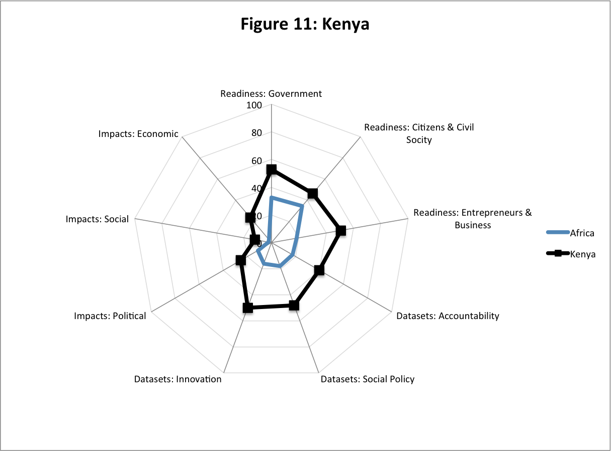
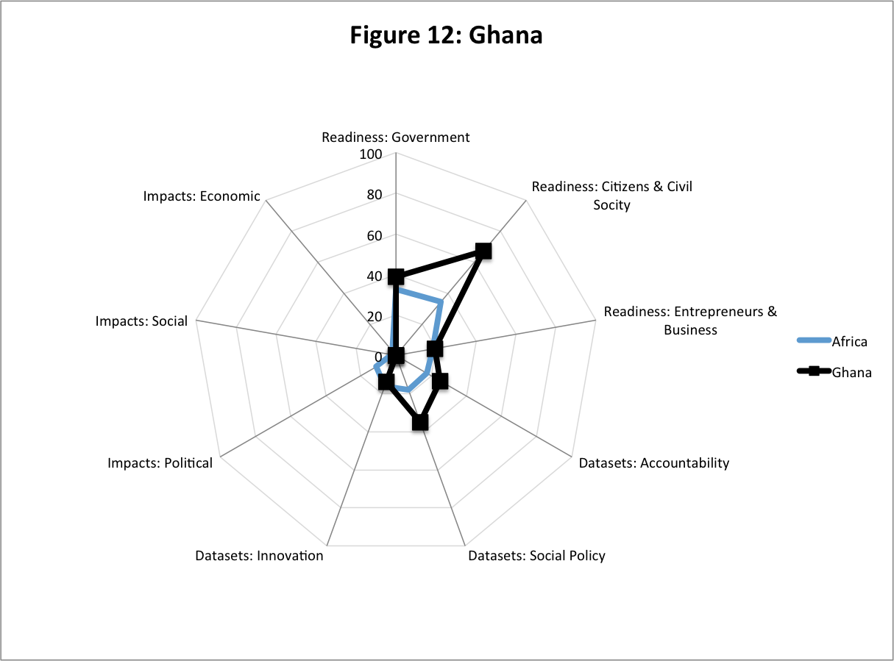
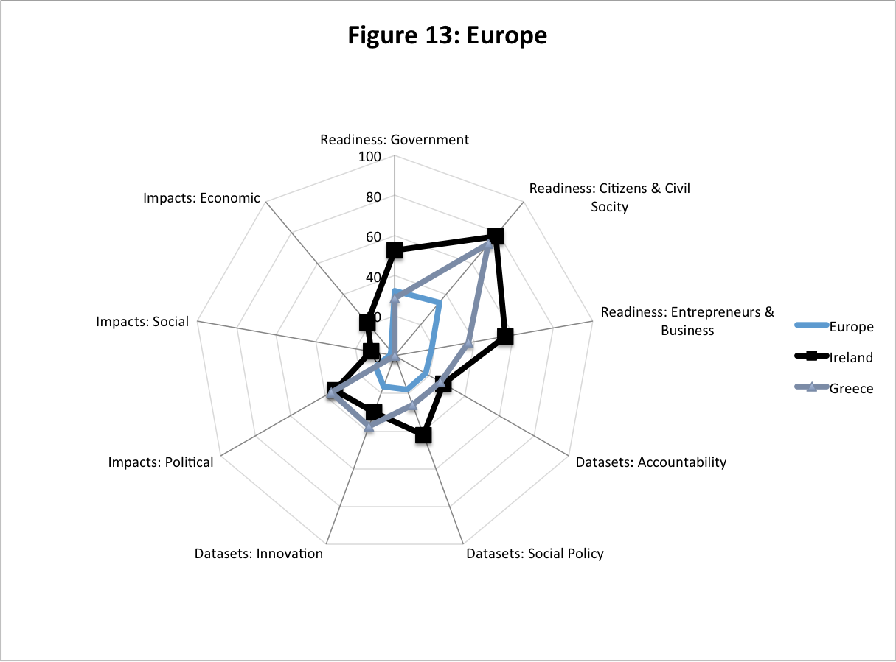

The Open Data Barometer forms part of a research project into common
assessment methods for open data initiatives. Through this we are
seeking to identify measurement approaches that can help inform open
data policy and practice, allowing governments, citizens and businesses
to understand the relative maturity of different Open Government Data
(OGD) initiatives, and to identify key areas for proactive interventions
that can unlock the potential of government data in diverse contexts.
Through the process of creating an index we are creating a shared
resource that can be used to explore various hypotheses about the
development of OGD. In addition through presenting data here, we offer a
starting point for further exploration and storytelling about the
commonalities and differences in OGD across the world. Our index is
necessarily a subjective construction: although one informed by wider
research and theory. In this section we outline the construction of the
Open Data Barometer rankings. You will also find details of how you can
access our data and create your own interpretations and analysis of open
data across the globe.

## Barometer structure and calculation

The Open Data Barometer is structured in three sub-indices to reflect
the different stages involved in realising the benefits of open data,
and the different groups who may be involved in, and may benefit from,
open data. The three sections are readiness, implementation and impact.

**Readiness** - identifies how far a country has in place the political,
social and economic foundations for realising the potential benefits of
open data. This sub-index contains three components:

-   **Government:** recognising the need for governments to have
    political will for an OGD initiative, and the technical capacity to
    put an OGD initiative into place;
-   **Entrepreneurs and business**: recognising the key role played
    by innovators and established firms as re-users and intermediaries
    of government data – and identifying the extent of existing capacity
    and support for open data use available to the private sector; 
-   **Citizen and civil society**: recognising the importance of
    political freedoms, rights and protections to allow citizens and
    civil society to use OGD to hold government to account, and to
    engage in improving policy;

**Implementation** - identifies the extent to which government has
published a range of key datasets to support innovation, accountability
and more improved social policy. This sub-index contains three
components, picking out clusters of datasets commonly used in:

-   Securing government **accountability;**
-   Improving **social policy**;and
-   Enabling **innovation** and economic activity.

**Emerging impacts** – identifies the extent to which open data has been
seen to lead to positive political, social and environment, and economic
change. This sub-index contains three components:

-   **Political impacts** – including transparency & accountability, and
    improved government efficiency and effectiveness;
-   **Economic impacts** – through supporting start-up entrepreneurs and
    existing businesses;
-   **Social impacts** – including environmental impacts, and
    contributing to greater inclusion for marginalised groups in
    society.

In the following sections we display detailed scores from each sub-index
for each country, along with an overall score, and then provide a
detailed breakdown of component scores for selected countries. This
helps to highlight the relative strengths and weaknesses across
different countries and regions, and to focus attention on areas for
deeper investigation.

### Calculating the rankings

To calculate each component an average of the variables in that
component is taken. The average of components is used to generate each
sub-index. Details of the variables in each component and sub-index can
be found in the Annexe. For consistency, the normalised scores for all
the sub-indexes, and the readiness and impacts components, have been
rescaled to a 0 - 100 range using the formula [(x - min)/(max -
min)]x100 prior to presentation. This means that a score of 100 on
these components and sub-indexes illustrates the highest scoring country
across the 77 included in the Barometer Global ranking. It does not mean
that a score of 100 is perfect.

All scores in a study of this kind are subject to a margin of error. To
offer an indicative comparison between countries we offer a ranking
based on rounding each countries overall ODB score to its integer value
(no decimal places), and placing countries in order of score. This
ranking, and each of the other scores, should be treated as the starting
point for exploration, rather than a definitive judgement on each
countries open data readiness, implementation and impacts.

### Country selection

The selection of countries covered in the Open Data Barometer is based
upon those included in the forthcoming 2013 Web Index, with four
exceptions due to difficulty sourcing primary data on time. This sample
was selected to represent a wide range of regions, levels of development
and political systems. The list of countries included in the Open Data
Barometer is: Argentina, Australia, Austria, Bahrain, Bangladesh,
Belgium, Benin, Botswana, Brazil, Burkina Faso, Cameroon, Canada, Chile,
China, Colombia, Costa Rica, Czech Republic, Denmark, Ecuador, Estonia,
Ethiopia, Finland, France, Germany, Ghana, Greece, Hungary, Iceland,
India, Indonesia, Ireland, Israel, Italy, Jamaica, Japan, Jordan,
Kazakhstan, Kenya, Korea, Republic of, Malawi, Mali, Mauritius, Mexico,
Morocco, Namibia, Nepal, Netherlands, New Zealand, Nigeria, Norway,
Pakistan, Peru, Philippines, Portugal, Qatar, Russian Federation,
Rwanda, Saudi Arabia, Senegal, Singapore, South Africa, Spain, Sweden,
Switzerland, Tanzania, United Republic of, Thailand, Tunisia, Turkey,
UAE, Uganda, United Kingdom, United States of America, Uruguay,
Venezuela, Yemen, Zambia and Zimbabwe.

### Get the data

The full data used to compute the Open Data Barometer is available from
[http://www.opendatabarometer.org](http://www.opendatabarometer.org) Open Data Barometer data is also
archived with the Zenodo research archive at
[https://zenodo.org/collection/user-opendatabarometer](https://zenodo.org/collection/user-opendatabarometer). Zenodo is a
permanent research archive hosted on CERN infrastructure, dedicated to
the long-term archival of research data. 

With the release of this report a number of files have been published.

<table class="dataset-listings">
    <tbody>
    <tr>
        <th>Filename</th>
        <th>Description</th>
    </tr>
    <tr>
        <td><a href="http://www.opendataresearch.org/dl/odb2013/OpenDataBarometer-ResearchHandbookDownloadVersion.pdf">Open Data Barometer - Research Handbook.pdf</a></td>
        <td>
            The detailed research handbook providing the full text of questions and source guidance used in the expert-survey.
        </td>
    </tr>
    <tr>
        <td><a href="http://www.opendataresearch.org/dl/odb2013/ODB-2013-Rankings.csv">ODB-2013-Rankings.csv</a></td>
        <td>The calculated components and sub-indexes of the 2013 Open Data Barometer.</td>
    </tr>
    <tr>
        <td><a href="http://www.opendataresearch.org/dl/odb2013/ODB-2013-Structure.csv">ODB-2013-Structure.csv</a></td>
        <td>All input variables included in the Open Data Barometer, their source and definition</td>
    </tr>
    <tr>
        <td><a href="http://www.opendataresearch.org/dl/odb2013/ODB-2013-ScoresMatrix.csv">ODB-2013-ScoresMatrix.csv</a></td>
        <td>Peer-reviewed numerical scores assigned to each primary data variable collected for the Open Data Barometer.</td>
    </tr>
    <tr>
        <td><a href="http://www.opendataresearch.org/dl/odb2013/ODB-2013-Datasets-Scored.csv">ODB-2013-Datasets-Scored.csv</a></td>
        <td>Validated and weighted dataset assessments; one row per dataset per country.</td>
    </tr>
    <tr>
        <td><a href="http://www.opendataresearch.org/dl/odb2013/ODB-2013-Calculations.xlsx">ODB-2013-Calculations.xls</a></td>
        <td>Primary and secondary data, along with calculations and final index values.</td>
    </tr>
 </tbody>
</table>

All data is licensed under the [Open Data Commons Attribution License](http://opendatacommons.org/licenses/by/). Please cite as: Web
Foundation, “Open Data Barometer: 2013 Global Report – Datasets” and include a link to www.opendatabarometer.org when re-using the data.
Better still, get in touch to let us know about any re-use or analysis you have made. E-mail project-odb@webfoundation.org or visit www.opendataresearch.org/network/ to find our online discussion spaces.

# Global ranking: results

The table below presents global rankings of the Barometer index. Scores
on each sub-index are based on normalised and scaled data, so indicate
the comparative position of countries.

<table class="sortable databars">
<thead>
 <tr>
  <th>Country</th>
  <th>Rank</th>
  <th>Readiness Sub-Index</th>
  <th>Implementation Sub-Index</th>
  <th>Impact Sub-Index</th>
  <th>ODB Overall</th>
 </tr>
 </thead>
 <tbody>
 <tr>
  <td>United Kingdom</td>
  <td class="no-bars">1</td>
  <td>100.00</td>
  <td>100.00</td>
  <td>79.91</td>
  <td>100.00</td>
  
 </tr>
 <tr>
  <td>United States</td>
  <td class="no-bars">2</td>
  <td>95.26</td>
  <td>86.67</td>
  <td>100.00</td>
  <td>93.38</td>
  
 </tr>
 <tr>
  <td>Sweden</td>
  <td class="no-bars">3</td>
  <td>95.20</td>
  <td>83.14</td>
  <td>71.95</td>
  <td>85.75</td>
  
 </tr>
 <tr>
  <td>New Zealand</td>
  <td class="no-bars">4</td>
  <td>81.88</td>
  <td>65.49</td>
  <td>89.81</td>
  <td>74.34</td>
  
 </tr>
 <tr>
  <td>Norway</td>
  <td class="no-bars">5</td>
  <td>91.88</td>
  <td>70.98</td>
  <td>46.15</td>
  <td>71.86</td>
 
 </tr>
 <tr>
  <td>Denmark</td>
  <td class="no-bars">5</td>
  <td>83.54</td>
  <td>70.20</td>
  <td>55.73</td>
  <td>71.78</td>
 
 </tr>
 <tr>
  <td>Australia</td>
  <td class="no-bars">7</td>
  <td>87.88</td>
  <td>64.71</td>
  <td>51.19</td>
  <td>67.68</td>
 
 </tr>
 <tr>
  <td>Canada</td>
  <td class="no-bars">8</td>
  <td>79.11</td>
  <td>63.92</td>
  <td>51.59</td>
  <td>65.87</td>
 
 </tr>
 <tr>
  <td>Germany</td>
  <td class="no-bars">9</td>
  <td>74.50</td>
  <td>63.14</td>
  <td>53.81</td>
  <td>65.01</td>
 
 </tr>
 <tr>
  <td>France</td>
  <td class="no-bars">10</td>
  <td>79.39</td>
  <td>64.31</td>
  <td>39.07</td>
  <td>63.92</td>
 
 </tr>
 <tr>
  <td>Netherlands</td>
  <td class="no-bars">10</td>
  <td>85.92</td>
  <td>67.06</td>
  <td>21.42</td>
  <td>63.66</td>
 
 </tr>
 <tr>
  <td>Korea (Rep. of)</td>
  <td class="no-bars">12</td>
  <td>77.19</td>
  <td>54.90</td>
  <td>24.56</td>
  <td>54.21</td>
 
 </tr>
 <tr>
  <td>Iceland</td>
  <td class="no-bars">13</td>
  <td>62.99</td>
  <td>52.94</td>
  <td>26.45</td>
  <td>51.01</td>
 
 </tr>
 <tr>
  <td>Estonia</td>
  <td class="no-bars">14</td>
  <td>72.38</td>
  <td>49.41</td>
  <td>24.00</td>
  <td>49.45</td>
 
 </tr>
 <tr>
  <td>Finland</td>
  <td class="no-bars">14</td>
  <td>91.19</td>
  <td>41.18</td>
  <td>40.87</td>
  <td>49.44</td>
 
 </tr>
 <tr>
  <td>Japan</td>
  <td class="no-bars">14</td>
  <td>76.99</td>
  <td>47.06</td>
  <td>27.94</td>
  <td>49.17</td>
 
 </tr>
 <tr>
  <td>Spain</td>
  <td class="no-bars">17</td>
  <td>67.48</td>
  <td>49.41</td>
  <td>21.13</td>
  <td>48.19</td>
 
 </tr>
 <tr>
  <td>Austria</td>
  <td class="no-bars">18</td>
  <td>68.56</td>
  <td>39.22</td>
  <td>48.62</td>
  <td>46.03</td>
 
 </tr>
 <tr>
  <td>Israel</td>
  <td class="no-bars">18</td>
  <td>61.82</td>
  <td>45.88</td>
  <td>25.36</td>
  <td>45.58</td>
 
 </tr>
 <tr>
  <td>Italy</td>
  <td class="no-bars">20</td>
  <td>50.39</td>
  <td>42.75</td>
  <td>45.69</td>
  <td>45.30</td>

 </tr>
 <tr>
  <td>Russia</td>
  <td class="no-bars">20</td>
  <td>54.43</td>
  <td>40.39</td>
  <td>48.86</td>
  <td>44.79</td>
 
 </tr>
 <tr>
  <td>Switzerland</td>
  <td class="no-bars">22</td>
  <td>65.11</td>
  <td>41.57</td>
  <td>26.80</td>
  <td>43.24</td>
 
 </tr>
 <tr>
  <td>Czech Republic</td>
  <td class="no-bars">22</td>
  <td>61.83</td>
  <td>40.00</td>
  <td>35.36</td>
  <td>43.18</td>
 
 </tr>
 <tr>
  <td>Kenya</td>
  <td class="no-bars">22</td>
  <td>49.70</td>
  <td>45.88</td>
  <td>21.55</td>
  <td>43.06</td>
  
 </tr>
 <tr>
  <td>Mexico</td>
  <td class="no-bars">25</td>
  <td>49.10</td>
  <td>45.49</td>
  <td>8.37</td>
  <td>40.30</td>
  
 </tr>
 <tr>
  <td>Chile</td>
  <td class="no-bars">25</td>
  <td>65.79</td>
  <td>39.22</td>
  <td>18.27</td>
  <td>40.11</td>
  
 </tr>
 <tr>
  <td>Portugal</td>
  <td class="no-bars">27</td>
  <td>60.38</td>
  <td>38.04</td>
  <td>19.25</td>
  <td>38.63</td>
  
 </tr>
 <tr>
  <td>Brazil</td>
  <td class="no-bars">28</td>
  <td>66.03</td>
  <td>32.16</td>
  <td>27.87</td>
  <td>36.83</td>
  
 </tr>
 <tr>
  <td>Singapore</td>
  <td class="no-bars">29</td>
  <td>70.28</td>
  <td>35.29</td>
  <td>8.97</td>
  <td>36.29</td>
  
 </tr>
 <tr>
  <td>Ireland</td>
  <td class="no-bars">29</td>
  <td>61.81</td>
  <td>32.55</td>
  <td>23.92</td>
  <td>35.76</td>
  
 </tr>
 <tr>
  <td>Thailand</td>
  <td class="no-bars">31</td>
  <td>38.09</td>
  <td>39.22</td>
  <td>14.88</td>
  <td>35.33</td>
  
 </tr>
 <tr>
  <td>Argentina</td>
  <td class="no-bars">31</td>
  <td>46.08</td>
  <td>36.47</td>
  <td>17.29</td>
  <td>35.00</td>
  
 </tr>
 <tr>
  <td>Belgium</td>
  <td class="no-bars">31</td>
  <td>72.01</td>
  <td>28.63</td>
  <td>25.64</td>
  <td>34.80</td>
  
 </tr>
 <tr>
  <td>India</td>
  <td class="no-bars">34</td>
  <td>57.36</td>
  <td>33.73</td>
  <td>9.87</td>
  <td>33.38</td>
  
 </tr>
 <tr>
  <td>Uruguay</td>
  <td class="no-bars">34</td>
  <td>54.66</td>
  <td>32.94</td>
  <td>13.31</td>
  <td>33.04</td>
  
 </tr>
 <tr>
  <td>Costa Rica</td>
  <td class="no-bars">36</td>
  <td>47.34</td>
  <td>35.29</td>
  <td>0.00</td>
  <td>31.21</td>
  
 </tr>
 <tr>
  <td>Kazakhstan</td>
  <td class="no-bars">37</td>
  <td>34.96</td>
  <td>32.16</td>
  <td>2.84</td>
  <td>27.61</td>
  
 </tr>
 <tr>
  <td>Greece</td>
  <td class="no-bars">37</td>
  <td>43.95</td>
  <td>27.84</td>
  <td>12.30</td>
  <td>27.59</td>
  
 </tr>
 <tr>
  <td>Turkey</td>
  <td class="no-bars">37</td>
  <td>41.92</td>
  <td>31.37</td>
  <td>0.00</td>
  <td>27.58</td>
  
 </tr>
 <tr>
  <td>Morocco</td>
  <td class="no-bars">40</td>
  <td>36.46</td>
  <td>27.84</td>
  <td>16.59</td>
  <td>27.24</td>
  
 </tr>
 <tr>
  <td>Colombia</td>
  <td class="no-bars">40</td>
  <td>44.33</td>
  <td>29.02</td>
  <td>2.49</td>
  <td>26.71</td>
  
 </tr>
 <tr>
  <td>Hungary</td>
  <td class="no-bars">42</td>
  <td>32.42</td>
  <td>28.63</td>
  <td>10.51</td>
  <td>26.09</td>
  
 </tr>
 <tr>
  <td>Mauritius</td>
  <td class="no-bars">42</td>
  <td>35.71</td>
  <td>30.59</td>
  <td>0.00</td>
  <td>26.08</td>
  
 </tr>
 <tr>
  <td>United Arab Emirates</td>
  <td class="no-bars">44</td>
  <td>53.88</td>
  <td>21.57</td>
  <td>12.30</td>
  <td>24.59</td>
  
 </tr>
 <tr>
  <td>Rwanda</td>
  <td class="no-bars">45</td>
  <td>36.71</td>
  <td>27.84</td>
  <td>0.00</td>
  <td>24.27</td>
  
 </tr>
 <tr>
  <td>Jamaica</td>
  <td class="no-bars">46</td>
  <td>32.56</td>
  <td>25.88</td>
  <td>2.49</td>
  <td>22.69</td>
  
 </tr>
 <tr>
  <td>Philippines</td>
  <td class="no-bars">47</td>
  <td>40.33</td>
  <td>21.18</td>
  <td>10.31</td>
  <td>21.91</td>
  
 </tr>
 <tr>
  <td>Peru</td>
  <td class="no-bars">47</td>
  <td>36.36</td>
  <td>23.14</td>
  <td>4.95</td>
  <td>21.74</td>
  
 </tr>
 <tr>
  <td>Ghana</td>
  <td class="no-bars">47</td>
  <td>39.51</td>
  <td>23.53</td>
  <td>0.00</td>
  <td>21.60</td>
  
 </tr>
 <tr>
  <td>Ecuador</td>
  <td class="no-bars">50</td>
  <td>38.51</td>
  <td>22.35</td>
  <td>2.83</td>
  <td>21.12</td>
  
 </tr>
 <tr>
  <td>Tunisia</td>
  <td class="no-bars">50</td>
  <td>63.52</td>
  <td>10.98</td>
  <td>26.46</td>
  <td>21.02</td>
  
 </tr>
 <tr>
  <td>South Africa</td>
  <td class="no-bars">52</td>
  <td>35.39</td>
  <td>18.43</td>
  <td>10.31</td>
  <td>19.20</td>
  
 </tr>
 <tr>
  <td>Indonesia</td>
  <td class="no-bars">52</td>
  <td>34.91</td>
  <td>20.39</td>
  <td>0.00</td>
  <td>18.66</td>
  
 </tr>
 <tr>
  <td>Bahrain</td>
  <td class="no-bars">54</td>
  <td>42.94</td>
  <td>18.04</td>
  <td>0.00</td>
  <td>18.18</td>
  
 </tr>
 <tr>
  <td>Uganda</td>
  <td class="no-bars">55</td>
  <td>23.99</td>
  <td>13.33</td>
  <td>23.07</td>
  <td>16.15</td>
  
 </tr>
 <tr>
  <td>Botswana</td>
  <td class="no-bars">55</td>
  <td>12.16</td>
  <td>21.57</td>
  <td>0.00</td>
  <td>16.08</td>
  
 </tr>
 <tr>
  <td>Nepal</td>
  <td class="no-bars">55</td>
  <td>21.15</td>
  <td>18.43</td>
  <td>2.84</td>
  <td>15.70</td>
  
 </tr>
 <tr>
  <td>Tanzania</td>
  <td class="no-bars">58</td>
  <td>20.43</td>
  <td>17.65</td>
  <td>0.00</td>
  <td>14.51</td>
  
 </tr>
 <tr>
  <td>Malawi</td>
  <td class="no-bars">59</td>
  <td>28.24</td>
  <td>11.76</td>
  <td>16.52</td>
  <td>14.47</td>
  
 </tr>
 <tr>
  <td>Qatar</td>
  <td class="no-bars">60</td>
  <td>39.01</td>
  <td>11.76</td>
  <td>0.00</td>
  <td>13.09</td>
  
 </tr>
 <tr>
  <td>China</td>
  <td class="no-bars">61</td>
  <td>41.72</td>
  <td>9.41</td>
  <td>0.00</td>
  <td>11.82</td>
  
 </tr>
 <tr>
  <td>Venezuela</td>
  <td class="no-bars">62</td>
  <td>9.59</td>
  <td>14.90</td>
  <td>0.00</td>
  <td>10.91</td>
  
 </tr>
 <tr>
  <td>Pakistan</td>
  <td class="no-bars">63</td>
  <td>14.59</td>
  <td>12.16</td>
  <td>0.00</td>
  <td>9.70</td>
  
 </tr>
 <tr>
  <td>Jordan</td>
  <td class="no-bars">63</td>
  <td>30.95</td>
  <td>8.63</td>
  <td>0.00</td>
  <td>9.63</td>
  
 </tr>
 <tr>
  <td>Bangladesh</td>
  <td class="no-bars">63</td>
  <td>23.00</td>
  <td>10.20</td>
  <td>0.00</td>
  <td>9.56</td>
  
 </tr>
 <tr>
  <td>Ethiopia</td>
  <td class="no-bars">66</td>
  <td>15.45</td>
  <td>10.59</td>
  <td>0.00</td>
  <td>8.70</td>
  
 </tr>
 <tr>
  <td>Burkina Faso</td>
  <td class="no-bars">67</td>
  <td>17.63</td>
  <td>8.24</td>
  <td>0.00</td>
  <td>7.35</td>
  
 </tr>
 <tr>
  <td>Benin</td>
  <td class="no-bars">67</td>
  <td>11.60</td>
  <td>9.41</td>
  <td>0.00</td>
  <td>7.28</td>
  
 </tr>
 <tr>
  <td>Saudi Arabia</td>
  <td class="no-bars">67</td>
  <td>40.82</td>
  <td>1.57</td>
  <td>5.69</td>
  <td>7.09</td>
  
 </tr>
 <tr>
  <td>Namibia</td>
  <td class="no-bars">67</td>
  <td>11.57</td>
  <td>9.02</td>
  <td>0.00</td>
  <td>7.00</td>
  
 </tr>
 <tr>
  <td>Senegal</td>
  <td class="no-bars">71</td>
  <td>28.57</td>
  <td>4.71</td>
  <td>0.00</td>
  <td>6.46</td>
  
 </tr>
 <tr>
  <td>Cameroon</td>
  <td class="no-bars">71</td>
  <td>7.11</td>
  <td>6.67</td>
  <td>5.56</td>
  <td>5.65</td>
  
 </tr>
 <tr>
  <td>Zimbabwe</td>
  <td class="no-bars">73</td>
  <td>15.20</td>
  <td>5.88</td>
  <td>0.00</td>
  <td>5.30</td>
  
 </tr>
 <tr>
  <td>Yemen</td>
  <td class="no-bars">73</td>
  <td>0.00</td>
  <td>8.24</td>
  <td>0.00</td>
  <td>4.69</td>
  
 </tr>
 <tr>
  <td>Nigeria</td>
  <td class="no-bars">75</td>
  <td>36.90</td>
  <td>0.00</td>
  <td>0.00</td>
  <td>4.35</td>
  
 </tr>
 <tr>
  <td>Zambia</td>
  <td class="no-bars">75</td>
  <td>11.84</td>
  <td>5.10</td>
  <td>0.00</td>
  <td>4.23</td>
  
 </tr>
 <tr>
  <td>Mali</td>
  <td class="no-bars">77</td>
  <td>6.15</td>
  <td>0.39</td>
  <td>0.00</td>
  <td>0.00</td>
  
 </tr>
 </tbody>
 <tfoot>
 <tr class="group">
  <td>Grand Total</td>
  <td class="no-bars"></td>
  <td>47.99</td>
  <td>32.20</td>
  <td>18.62</td>
  <td>32.47</td>
 </tr>
 </tfoot>
</table>

*Table 4: Sub-index and overall scores. Each column independently scaled on a 0 - 100 min-max scale (i.e. 100 = top scorer out of our sample; but does not indicate a perfect score on that component). Rank based on rounded integer value of overall score.*

## Country analysis: top five

Table 4 shows a clear regional variation between the readiness,
 implementation and impact scores assigned by the Open Data Barometer. In
 the following pages we explore the scores of selected countries, and dig
 into the narratives behind these scores, drawing on secondary literature
 and the qualitative data gathered during the Barometer survey. The focus
 here is on drawing out lessons from OGD initiative strengths, and
 highlighting unique aspects of different initiatives, rather and
 providing a full critical assessment of each initiative, and these
 narratives should be read in light of the substantial distance all
 countries still have to travel before they can claim to be fully ‘open
 by default’.

### United Kingdom (Overall rank \#1) 

 The UKs weakest area in the Barometer ranking is in securing social
 impact from open data, and although there are some experiments taking
 place to make community and local government data available to support
 policy discussions, recent government policy has particularly emphasised
 economic re-use of data, and requiring economically-centred ‘business
 cases’ to justify data release, rather than looking to support thematic
 communities of practice around data. Only limited examples of open data
 used as a tool for more open policy making exist. Concerns have also
 been raised that the ‘open by default’ principle the government signed
 up to in the G8 Open Data Charter (G8, 2013) may not be applied to
 important new datasets such as a register of company beneficial
 ownership being created to address tax dodging and corruption. Civil
 society organisations have criticised the government’s reluctance to
 make an explicit commitment to providing this as open data, and slow
 progress on providing existing comprehensive data from the companies
 register.

 Across the extensive data that is provided by the government, there are
 clear efforts to increase quality, standardisation, reliability and
 link-ability. A number of datasets surveyed in the barometer (national
 map, land registry, company registry, and legislation) are available as
 five star linked data. In response to a 2013 independent review of
 Public Sector Information policy (Shakespeare, 2013), the UK is now
 increasingly focussed on articulating and developing a National
 Information Infrastructure of core datasets that need to be maintained,
 developed and enhanced as open data. A number of departments are
 exploring how to build their public web presence on top of their open
 data publication, creating platforms that are ‘open all the way down’,
 including legislation.gov.uk, and the http://devtracker.dfid.gov.uk site
 which brings together IATI standard aid transparency data from different
 government departments. 

### United States (Overall rank \#2)

 The US government has placed a strong emphasis on bringing innovators
 into government, and increasing engagement between government and
 outside communities, linked to the idea of ‘government as a platform’
 (O’Reilly, 2010). A programme of ‘Presidential Innovation Fellows’ has
 seen private sector experts embedded in government departments on
 short-term placement to support open data work, and a series of
 high-profile ‘Datapalooza’ events sought to engage entrepreneurs in
 solving social problems and building businesses using government data.
 The US also benefits from a wide range of civil society organisations
 seeking to work with government data for transparency and accountability
 purposes.

 There has been a particular emphasis placed in the development of the
 data.gov data portal placed on the ‘Communities’ section, creating
 thematic spaces that bring together content, documentation and
 discussions on topics such as agriculture, health, energy, law and
 manufacturing. However, recent experiences of the US Government Shutdown
 highlighted the weaknesses of a centralised data portal approach, when
 access to data.gov was turned off for two weeks – leaving anyone relying
 on Open Government Data without access to this essential resource. 

### Sweden (Overall rank \#3)

 Sweden’s OGD portal does face some weaknesses when it comes to clear
 licencing, with a number of key datasets published without an open
 licence. The portal itself is managed by the Vinnova, the National
 Innovation Agency, and has a dedicated staff who have also been involved
 in supporting pilot open data projects in different cities and
 organisations across Sweden.  

 Hack day and innovation events have taken place across the country to
 stimulate engagement with data, and projects such as TrafikLab bring
 together public and private data on transport in one platform for
 innovators to build on. Sweden scores particularly highly across the
 impact components of the Barometer, with examples of open data use to
 improve the efficiency of healthcare, and use of environmental data by
 data journalists to visualise how cuts to the environment budget might
 affect endangered species. 

### New Zealand (Overall rank \#4)

 Whilst there is a civil society community engaging with government
 around open data in New Zealand, the community is relatively small.
 There have been some hack day events and app competitions since 2010,
 but government has not yet widely experimented with grants, innovation
 vouchers or incubator programmes to stimulate entrepreneurial re-use of
 open data. 

 The New Zealand Government has put considerable effort into monitoring
 progress towards open government and open data, with Agencies asked to
 regularly report to Ministers on their progress, case studies collated
 on re-uses of open data, and an annual reporting process on adoption of
 the Declaration on Open and Transparent Government. New Zealand was one
 of the few countries in the Barometer where a significant emphasis on
 environmental impacts of open data could be observed, with a wide range
 of environmental datasets made available and seeing re-use, particularly
 in supporting coordination around extreme weather and geological events.

### Denmark and Norway (Overall joint rank \#5)

 Denmark and Norway both rank highly in the Open Data Barometer, with
 governments, civil society and businesses well placed to secure benefits
 from open data. Both countries also have a broad range of data available
 in machine-readable and bulk formats, although their strategies to
 achieve this vary. 

 In Norway, an open data platform has been undergoing iterative
 development since 2010, with a blog initially launched to engage the
 community, and then a data catalogue launched in 2011. Run by the Agency
 for Public Management and eGovernment (Difi), the platform has also
 created the ‘Data Hotel’, a hosted API and data store which will host
 machine-readable copies of government data through a common API, and
 which provides stable URIs (links) for many elements in these datasets.
 The Data Hotel is offered as an optional service to government agencies
 publishing on the data.norge.no portal, allowing them to increase the
 accessibility of their data for users.

 Norway is one of the three countries in the Barometer with a fully open
 company register, and has reported strong uptake, including from the
 business community who are using API access onto the register for
 e-invoicing, clocking up over 190,000 hits a month within the first
 year. 

 It is notable in the radar chart above that Denmark demonstrates higher
 availability of accountability datasets and stronger political impacts,
 whilst also seeing lower business readiness to engage with open data and
 secure benefits from it, along with lower availability of innovation
 enabling datasets. However, access to data has still had a substantial
 economic impact in Denmark. In 2002 the government launched an agreement
 to provide free of charge access to address data. A 2010 evaluation of
 the policy commissioned by the Danish Enterprise and Construction
 Authority found that 1,200 parties were consuming the data via 22 public
 data distributors, with an estimated financial benefit to society of EUR
 62 million, against costs to 2009 of only EUR 2 million (DECA, 2010).
 Although not framed in terms of open data, this policy demonstrates the
 importance of key datasets as inputs for a wide range of business
 activities.

## Regional rankings

 The table below presents Barometer rankings grouped by region. 

<table class="sortable databars">
<thead>
<tr>
<th>Country</th>
<th>Readiness Sub-Index</th>
<th>Implementation Sub-Index</th>
<th>Impact Sub-Index</th>
<th>ODB Overall</th>
</tr>
</thead>
<tbody>
<tr class="group">
<td>Africa</td>
<td>25.90</td>
<td>14.73</td>
<td>5.72</td>
<td>14.29</td>
</tr>
<tr>
<td>Kenya</td>
<td>49.70</td>
<td>45.88</td>
<td>21.55</td>
<td>43.06</td>
</tr>
<tr>
<td>Morocco</td>
<td>36.46</td>
<td>27.84</td>
<td>16.59</td>
<td>27.24</td>
</tr>
<tr>
<td>Mauritius</td>
<td>35.71</td>
<td>30.59</td>
<td>0.00</td>
<td>26.08</td>
</tr>
<tr>
<td>Rwanda</td>
<td>36.71</td>
<td>27.84</td>
<td>0.00</td>
<td>24.27</td>
</tr>
<tr>
<td>Ghana</td>
<td>39.51</td>
<td>23.53</td>
<td>0.00</td>
<td>21.60</td>
</tr>
<tr>
<td>Tunisia</td>
<td>63.52</td>
<td>10.98</td>
<td>26.46</td>
<td>21.02</td>
</tr>
<tr>
<td>South Africa</td>
<td>35.39</td>
<td>18.43</td>
<td>10.31</td>
<td>19.20</td>
</tr>
<tr>
<td>Botswana</td>
<td>12.16</td>
<td>21.57</td>
<td>0.00</td>
<td>16.08</td>
</tr>
<tr>
<td>Uganda</td>
<td>23.99</td>
<td>13.33</td>
<td>23.07</td>
<td>16.15</td>
</tr>
<tr>
<td>Tanzania</td>
<td>20.43</td>
<td>17.65</td>
<td>0.00</td>
<td>14.51</td>
</tr>
<tr>
<td>Malawi</td>
<td>28.24</td>
<td>11.76</td>
<td>16.52</td>
<td>14.47</td>
</tr>
<tr>
<td>Ethiopia</td>
<td>15.45</td>
<td>10.59</td>
<td>0.00</td>
<td>8.70</td>
</tr>
<tr>
<td>Burkina Faso</td>
<td>17.63</td>
<td>8.24</td>
<td>0.00</td>
<td>7.35</td>
</tr>
<tr>
<td>Benin</td>
<td>11.60</td>
<td>9.41</td>
<td>0.00</td>
<td>7.28</td>
</tr>
<tr>
<td>Namibia</td>
<td>11.57</td>
<td>9.02</td>
<td>0.00</td>
<td>7.00</td>
</tr>
<tr>
<td>Senegal</td>
<td>28.57</td>
<td>4.71</td>
<td>0.00</td>
<td>6.46</td>
</tr>
<tr>
<td>Cameroon</td>
<td>7.11</td>
<td>6.67</td>
<td>5.56</td>
<td>5.65</td>
</tr>
<tr>
<td>Zimbabwe</td>
<td>15.20</td>
<td>5.88</td>
<td>0.00</td>
<td>5.30</td>
</tr>
<tr>
<td>Zambia</td>
<td>11.84</td>
<td>5.10</td>
<td>0.00</td>
<td>4.23</td>
</tr>
<tr>
<td>Nigeria</td>
<td>36.90</td>
<td>0.00</td>
<td>0.00</td>
<td>4.35</td>
</tr>
<tr>
<td>Mali</td>
<td>6.15</td>
<td>0.39</td>
<td>0.00</td>
<td>0.00</td>
</tr>
<tr class="group">
<td>Americas</td>
<td>51.13</td>
<td>37.50</td>
<td>19.19</td>
<td>36.84</td>
</tr>
<tr>
<td>United States</td>
<td>95.26</td>
<td>86.67</td>
<td>100.00</td>
<td>93.38</td>
</tr>
<tr>
<td>Canada</td>
<td>79.11</td>
<td>63.92</td>
<td>51.59</td>
<td>65.87</td>
</tr>
<tr>
<td>Mexico</td>
<td>49.10</td>
<td>45.49</td>
<td>8.37</td>
<td>40.30</td>
</tr>
<tr>
<td>Chile</td>
<td>65.79</td>
<td>39.22</td>
<td>18.27</td>
<td>40.11</td>
</tr>
<tr>
<td>Brazil</td>
<td>66.03</td>
<td>32.16</td>
<td>27.87</td>
<td>36.83</td>
</tr>
<tr>
<td>Argentina</td>
<td>46.08</td>
<td>36.47</td>
<td>17.29</td>
<td>35.00</td>
</tr>
<tr>
<td>Uruguay</td>
<td>54.66</td>
<td>32.94</td>
<td>13.31</td>
<td>33.04</td>
</tr>
<tr>
<td>Costa Rica</td>
<td>47.34</td>
<td>35.29</td>
<td>0.00</td>
<td>31.21</td>
</tr>
<tr>
<td>Colombia</td>
<td>44.33</td>
<td>29.02</td>
<td>2.49</td>
<td>26.71</td>
</tr>
<tr>
<td>Jamaica</td>
<td>32.56</td>
<td>25.88</td>
<td>2.49</td>
<td>22.69</td>
</tr>
<tr>
<td>Peru</td>
<td>36.36</td>
<td>23.14</td>
<td>4.95</td>
<td>21.74</td>
</tr>
<tr>
<td>Ecuador</td>
<td>38.51</td>
<td>22.35</td>
<td>2.83</td>
<td>21.12</td>
</tr>
<tr>
<td>Venezuela</td>
<td>9.59</td>
<td>14.90</td>
<td>0.00</td>
<td>10.91</td>
</tr>
<tr class="group">
<td>Asia Pacific</td>
<td>51.18</td>
<td>33.24</td>
<td>18.49</td>
<td>33.67</td>
</tr>
<tr>
<td>New Zealand</td>
<td>81.88</td>
<td>65.49</td>
<td>89.81</td>
<td>74.34</td>
</tr>
<tr>
<td>Australia</td>
<td>87.88</td>
<td>64.71</td>
<td>51.19</td>
<td>67.68</td>
</tr>
<tr>
<td>Korea (Rep. of)</td>
<td>77.19</td>
<td>54.90</td>
<td>24.56</td>
<td>54.21</td>
</tr>
<tr>
<td>Japan</td>
<td>76.99</td>
<td>47.06</td>
<td>27.94</td>
<td>49.17</td>
</tr>
<tr>
<td>Singapore</td>
<td>70.28</td>
<td>35.29</td>
<td>8.97</td>
<td>36.29</td>
</tr>
<tr>
<td>Thailand</td>
<td>38.09</td>
<td>39.22</td>
<td>14.88</td>
<td>35.33</td>
</tr>
<tr>
<td>India</td>
<td>57.36</td>
<td>33.73</td>
<td>9.87</td>
<td>33.38</td>
</tr>
<tr>
<td>Philippines</td>
<td>40.33</td>
<td>21.18</td>
<td>10.31</td>
<td>21.91</td>
</tr>
<tr>
<td>Indonesia</td>
<td>34.91</td>
<td>20.39</td>
<td>0.00</td>
<td>18.66</td>
</tr>
<tr>
<td>Nepal</td>
<td>21.15</td>
<td>18.43</td>
<td>2.84</td>
<td>15.70</td>
</tr>
<tr>
<td>China</td>
<td>41.72</td>
<td>9.41</td>
<td>0.00</td>
<td>11.82</td>
</tr>
<tr>
<td>Pakistan</td>
<td>14.59</td>
<td>12.16</td>
<td>0.00</td>
<td>9.70</td>
</tr>
<tr>
<td>Bangladesh</td>
<td>23.00</td>
<td>10.20</td>
<td>0.00</td>
<td>9.56</td>
</tr>
<tr class="group">
<td>Europe</td>
<td>68.97</td>
<td>50.12</td>
<td>35.34</td>
<td>51.50</td>
</tr>
<tr>
<td>United Kingdom</td>
<td>100.00</td>
<td>100.00</td>
<td>79.91</td>
<td>100.00</td>
</tr>
<tr>
<td>Sweden</td>
<td>95.20</td>
<td>83.14</td>
<td>71.95</td>
<td>85.75</td>
</tr>
<tr>
<td>Norway</td>
<td>91.88</td>
<td>70.98</td>
<td>46.15</td>
<td>71.86</td>
</tr>
<tr>
<td>Denmark</td>
<td>83.54</td>
<td>70.20</td>
<td>55.73</td>
<td>71.78</td>
</tr>
<tr>
<td>Germany</td>
<td>74.50</td>
<td>63.14</td>
<td>53.81</td>
<td>65.01</td>
</tr>
<tr>
<td>France</td>
<td>79.39</td>
<td>64.31</td>
<td>39.07</td>
<td>63.92</td>
</tr>
<tr>
<td>Netherlands</td>
<td>85.92</td>
<td>67.06</td>
<td>21.42</td>
<td>63.66</td>
</tr>
<tr>
<td>Iceland</td>
<td>62.99</td>
<td>52.94</td>
<td>26.45</td>
<td>51.01</td>
</tr>
<tr>
<td>Estonia</td>
<td>72.38</td>
<td>49.41</td>
<td>24.00</td>
<td>49.45</td>
</tr>
<tr>
<td>Finland</td>
<td>91.19</td>
<td>41.18</td>
<td>40.87</td>
<td>49.44</td>
</tr>
<tr>
<td>Spain</td>
<td>67.48</td>
<td>49.41</td>
<td>21.13</td>
<td>48.19</td>
</tr>
<tr>
<td>Austria</td>
<td>68.56</td>
<td>39.22</td>
<td>48.62</td>
<td>46.03</td>
</tr>
<tr>
<td>Italy</td>
<td>50.39</td>
<td>42.75</td>
<td>45.69</td>
<td>45.30</td>
</tr>
<tr>
<td>Russia</td>
<td>54.43</td>
<td>40.39</td>
<td>48.86</td>
<td>44.79</td>
</tr>
<tr>
<td>Switzerland</td>
<td>65.11</td>
<td>41.57</td>
<td>26.80</td>
<td>43.24</td>
</tr>
<tr>
<td>Czech Republic</td>
<td>61.83</td>
<td>40.00</td>
<td>35.36</td>
<td>43.18</td>
</tr>
<tr>
<td>Portugal</td>
<td>60.38</td>
<td>38.04</td>
<td>19.25</td>
<td>38.63</td>
</tr>
<tr>
<td>Ireland</td>
<td>61.81</td>
<td>32.55</td>
<td>23.92</td>
<td>35.76</td>
</tr>
<tr>
<td>Belgium</td>
<td>72.01</td>
<td>28.63</td>
<td>25.64</td>
<td>34.80</td>
</tr>
<tr>
<td>Greece</td>
<td>43.95</td>
<td>27.84</td>
<td>12.30</td>
<td>27.59</td>
</tr>
<tr>
<td>Turkey</td>
<td>41.92</td>
<td>31.37</td>
<td>0.00</td>
<td>27.58</td>
</tr>
<tr>
<td>Hungary</td>
<td>32.42</td>
<td>28.63</td>
<td>10.51</td>
<td>26.09</td>
</tr>
<tr class="group">
<td>Middle East &amp; C. Asia</td>
<td>38.05</td>
<td>18.48</td>
<td>5.77</td>
<td>18.81</td>
</tr>
<tr>
<td>Israel</td>
<td>61.82</td>
<td>45.88</td>
<td>25.36</td>
<td>45.58</td>
</tr>
<tr>
<td>Kazakhstan</td>
<td>34.96</td>
<td>32.16</td>
<td>2.84</td>
<td>27.61</td>
</tr>
<tr>
<td>United Arab Emirates</td>
<td>53.88</td>
<td>21.57</td>
<td>12.30</td>
<td>24.59</td>
</tr>
<tr>
<td>Bahrain</td>
<td>42.94</td>
<td>18.04</td>
<td>0.00</td>
<td>18.18</td>
</tr>
<tr>
<td>Qatar</td>
<td>39.01</td>
<td>11.76</td>
<td>0.00</td>
<td>13.09</td>
</tr>
<tr>
<td>Jordan</td>
<td>30.95</td>
<td>8.63</td>
<td>0.00</td>
<td>9.63</td>
</tr>
<tr>
<td>Saudi Arabia</td>
<td>40.82</td>
<td>1.57</td>
<td>5.69</td>
<td>7.09</td>
</tr>
<tr>
<td>Yemen</td>
<td>0.00</td>
<td>8.24</td>
<td>0.00</td>
<td>4.69</td>
</tr>
</tbody>
<tfoot>
    <tr class="group">
        <td>Grand Total</td>
        <td>47.99</td>
        <td>32.20</td>
        <td>18.62</td>
        <td>32.47</td>
</tr>
</tfoot>
</table>

*Table 5: Sub-index and overall scores. Each column independently scaled
on a 0 - 100 min-max scale (i.e. 100 = top scorer out of our sample; but
does not indicate a perfect score on that component).*

## Regional analysis: Africa

The first OGD initiative in Africa was launched in Morocco in April
2011, closely followed by Kenya in July of that year. A number of other
countries have explored creating OGD initiatives, and international
donors such as the World Bank have been supporting open data readiness
studies across the continent. Civil society groups have also engaged
with campaigning for open data in countries such as Uganda and South
Africa. The African Development Bank has launched the Open Data For
Africa platform (www.opendataforafrica.org) bringing together key
statistical indicators as open data from all 54 African countries,
although we did not find any countries linking out to this portal or
pointing their citizens to it. Where data was available from African
governments, it was often provided through national statistical
services, the beneficiaries of considerable investment in statistical
capacity building over recent years. Adding support for these agencies
to publish bulk machine-readable data, and to apply open licenses, could
increase the supply of fully open data on the continent. 

Budgets were also often published online in ways that are just a few
steps from being fully open data. However, many important datasets will
be trickier to secure as open data – as robust digital data collection
and management is often lacking when it comes to information such as
detailed public service performance, government spending, land
registration, company registration and national maps. Given one of the
factors underlying the role of OGD in stimulating entrepreneurial
activity is the idea that government data is comprehensive and reliable
(Lakomaa & Kallberg, 2013), models of open data based innovation in
areas of Africa may need to develop new approaches, potentially based
around open approaches to generating, rather than using, key public
datasets. 

### Kenya (Overall rank \#22)

Significant effort has gone into capacity building with the local
technology community, and with journalists as key open data
intermediaries. Initiatives include hack days, data journalism training,
and the Code for Kenya incubator, which embedded data experts inside
established news organisations. These projects have often faced
challenges getting relevant data from the opendata.go.ke portal, but
have managed to access datasets through data scraping and interacting
directly with ministries, suggesting that the idea of open data has
acted as a catalyst for a range of activities, even if open datasets are
not, in the end, the main input to those activities. 

Civil society groups have also engaged with the open data agenda,
exploring how open data could be a resource for informing and empowering
marginalised communities. Early research suggests that there is a long
way to go before the impacts of the open data initiative are widely
felt. In a recent survey of Kenyan citizens, the Jesuit Hakamani Trust
found that whilst there was significant demand from the population for
government data, at most 14% of citizens were aware of, or had accessed,
the national open data portal (Mokua & Chiliswa, 2013), and open data
will need to be accessible through a range of non-technical
intermediaries such as community centres and radio if the gap between
information online, and effective access to information for citizens is
to be bridged. 

### Morocco, Mauritius, Rwanda  (Overall ranks \#40, \#42, \#45)

Morocco launched an open data portal in April 2011, with a focus on
financial datasets. The portal currently hosts 50 datasets, all placed
under a clear Open Database License. There has been limited outreach
around the portal, although the increased availability of budget and
finance information has stimulated discussions about government
transparency, and some local experimentation with different ways to
visualise and use the data.

Neither Rwanda nor Mauritius currently have OGD initiatives, although
Mauritius has included elements on open data within its 2013-17
eGovernment Strategy, focussing on its potential contribution to
transparency, public service improvement, innovation and efficiency. 

### Ghana (Overall rank \#47)

Ghana began an OGD Initiative in early 2012, following a readiness assessment carried outby the World Wide Web Foundation in May
2011. The Initiative has launched a ‘beta’ opendata portal for public comment, with around120 datasets from 12 departments, and is
focussing on the development of clear opendata strategy and on building an open datacommunity in the country. Ghana recently
passed a Right to Information Law, and hashad a data protection law on the books since2012, providing key foundations for trust in the
OGD initiative. However, both laws are yet tobe fully tested in practice. With external supportthe government has run data journalism
training, but there is a lot more to be done tobuild a community of intermediaries around the data published by government, and to increase the quality and reliability of key datasets as the open data portal moves from beta to a production version.


## Regional analysis: Europe

A number of European countries have already been discussed in the top five analyses. Looking at the overall picture for Europe,
countries are generally strong on the civil society readiness component. This component includes issues such as the
presence of Right to Information legislation, political freedoms, and the quality of Data Protection Laws. We hypothesise that clear
data protection regimes are important for citizen trust in open data, and to ensure (a) that private data is not wrongly released
during open data programmes; and (b) that open data cannot be easily abused by being combined with other retained records on
individuals. European Union and Council of Europe instruments contribute strongly to the consistent and robust data protection regime in Europe.

The civil society readiness component also includes a variable
concerning the extent of bottom-up campaigning for open data. A number
of countries have well developed advocacy for open data, with broad
coalitions of developers, academics and civil society, yet have not yet
secured clear government commitment and action on open data. Notable
examples include Ireland and Greece, both of which have also had a
strong community focus on Linked Data. 

With a few exceptions, whilst most European nations have high levels of
internet penetration, and firms with capacity to absorb ICTs, there are
considerable opportunities for governments to increase the availability
of open data related training, and to invest in support for innovation
and open data re-use in order to have a greater chance to gaining
benefits from data publication.

## Regional analysis: Middle East and Central Asia

Amongst the Middle East and Central Asia countries in the ODB sample
only Yemen has no evidence of any Open Government Data activity.
Bahrain, Kazakhstan and Israel each have dedicated open data portals,
and the United Arab Emirates, Jordan and Qatar have created Open
Government Data pages on existing government websites. Elbadawi’s
argument that Gulf Coooperation Council open data initiatives are
primarily e-government driven (Elbadawi, 2012) is supported by the ODB
data, showing strong government technology capacity, but much more
limited civil society and private sector readiness to secure benefits
from open data. Without strong foundations of civil society freedoms,
the Right to Information and Data Protection, it is likely to be far
harder for transparency and accountability benefits of open data to be
secured. 

The region has also seen very little support for innovation with open
data, suggesting the economic potential of open data will also be hard
to realise. This raises questions about the motivation and drivers for
the launch of open data portals and platforms.

Open data is written into a number of national e-government action plans
in the region, and is a component of Jordan’s Open Government
Partnership action plan. However, a pattern of stop-start OGD initiative
development so far is apparent from our qualitative research. Bahrain’s
OGD initiative delivered a portal in 2011, but it has been largely
dormant since. In Israel, an OGD initiative began with ministerial
backing, but progress appeared to slow when the minister involved left
the government. Both appear to be receiving new attention, but a lack of
sustained progress is likely to have harmed the confidence of potential
users, and work will be needed to build community and re-user confidence
in open data supply. 

## Regional analysis: Asia Pacific

Together the countries in our Asia Pacific regional grouping account for
over 3.5bn of the world population, and represent a full range of levels
in the Human Development Index (HDI). 

In the low HDI countries (Bangladesh, Pakistan and Nepal) only Nepal has
seen substantial activity around open data, although this is primarily
led by civil society, and is substantially driven by an aid transparency
agenda, recognising the substantial contribution that international
donors make to the national budget. Amongst medium-ranked HDI countries
(China, India, Indonesia, Philippines, and Thailand) there are a number
of different approaches. China has a national initiative on ‘Open
Government’, but no explicit open data initiative at the national level,
although some activity is taking place in Shanghai City. Availability of
key open datasets in China is amongst the lowest in the Barometer
rankings. Indonesia and the Philippines are both at the early stages of
developing OGD initiatives, with significant work to do to increase the
availability of structured, machine-readable data. As Sunlight
Foundation have recently argued, whilst the Philippines has good legally
mandated disclosures of contracting information, as well as having
strong incentives for local government units to publish information
online, the absence of machine-readable open data makes searching
through all this information challenging, and limits public engagement
in the transparency and accountability process (Furnas, 2013). India’s
Open Government Data initiative has built upon the introduction of the
National Data Sharing and Accessibility Policy (NDSAP), and has led to
the launch of the data.gov.in portal. The initiative is notable for
publically announcing ‘data controllers’ for government ministries and
departments, offering citizens and entrepreneurs a direct channel to
data holders in various departments, rather than routing all
communications with government through a central portal. 

Amongst higher HDI countries, Japan’s Open Government Data policy has
received a boost through the recent G8 Open Data Charter. New Zealand,
South Korea, Australia, Japan and Singapore all have a high level of
government and private sector readiness to secure benefits from open
data, although civil society readiness is notably lower in Singapore and
Korea. 

## Regional analysis: Latin America and the Caribbean 

The first regional conference on Open Data in Latin America and the
Caribbean took place in June 2013, bringing together emerging and
established initiatives from across the region. Those involved have
suggested that this event also saw evidence of new forms of civil
society collaboration emerging, with technologists, activists, private
sector, government officials and policy makers all coming together
around open data as a catalyst for cooperation.

In the ODB rankings, Mexico and Chile jointly top the regional table for
Latin America and the Caribbean (LAC) closely followed by Brazil and
Argentina. At the national level, LAC countries are generally stronger
in their governmental and civil society readiness, than in business and
entrepreneur readiness, but this may hide significant sub-national
variations, with major cities acting as hubs of entrepreneurial open
data activity. The smart-cities agenda present in many of the large
urban centres of the region provides one point of connection between
open data and wider technical change. Not only can open data play an
important role in smart cities innovations (for example, through
innovation on top of standardised public transport data), but as
technical platforms become increasingly embedded in the governance of
cities it is important to ensure that citizens have open access to data
on their cities that will enable them to engage in policy discussions. 

A number of regional open data activities build on a history of
‘transparency portals’ that gave legally mandated access to public
finance information. As a result, moves to make public spending data
available as open data in Brazil, for example, are backed by strong
mandates to ensure the data is published in a timely fashion. Brazil has
also framed the launch of its open data portal, datos.gov.br within a
‘National Infrastructure of Open Data’ project, setting out technical
standards for sharing public sector information, and linking the open
data and free software agendas.

# Conclusions

This brief regional survey does not pretend to be a comprehensive review
of the similarities and differences between national OGD policies.
However, it does begin to demonstrate how the comparative data in the
Open Data Barometer can provide the starting point for deeper analysis
of different OGD programmes around the world, and for thinking about the
different kinds of interventions that can be encouraged to secure
benefits from open data. 

We’ve not been able to say as much in this discussion about the emerging
impacts of open data in different countries as we would have liked. As
already mentioned, the majority of evidence remains anecdotal, and hard
to draw detailed cross-country comparisons with at present, particularly
given the significant variations in the populations of the countries
covered by the ODB study. 

We hope that, ultimately, the Open Data Barometer 2013 report, data and
methods establish an initial baseline for tracking open data
developments around the world, and act as a contribution to the
discussion of approaches to monitor and measure open data progress. 

This report is just one route into the Barometer study. The greater
value of our research lies in the dataset that we have, naturally, made
available as open data for others to analyse and build upon – and which
we will continue to analyse and report on at www.opendatabarometer.org 

